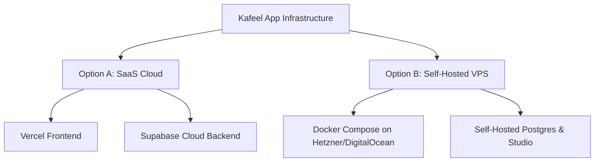

# دراسة المخاطر، استقرار النظام، والقدرة الاستيعابية وتحديات النشر
# Risk, Capacity, & Hosting Infrastructure Assessment

---

## 1. Executive Summary / الملخص التنفيذي

### 🌐 English Version
This document provides a comprehensive security, technical, and financial risk assessment for the **Kafeel (كفيل)** interest-free Murabaha management system. The platform is designed with a modern micro-frontend structure (React 19, TypeScript, Vanilla CSS) and serverless database endpoints (Supabase, PostgreSQL, Deno Edge Functions). This study highlights short-term and long-term pitfalls for developer teams, computes strict performance and database threshold capacities, and evaluates server hosting structures to support safe deployment across multiple car showrooms and banking offices.

### 🇸🇦 النسخة العربية
تقدم هذه الوثيقة تقييماً شاملاً للمخاطر الأمنية والفنية والتشغيلية لمنظومة **كفيل (Kafeel)** المخصصة لإدارة معاملات المرابحة الإسلامية الخالية من الفوائد. تم بناء المنظومة بهيكل واجهة برمجية حديثة (React 19، TypeScript، Vanilla CSS) مع خدمات خلفية سحابية (Supabase، PostgreSQL، ودوال Deno Edge السحابية). تهدف هذه الدراسة إلى تحديد العقبات الفنية التي قد تواجه فريق التطوير على المدى القريب والبعيد، وتحليل السعة الاستيعابية القصوى وقدرات النظام، بالإضافة إلى مقارنة خيارات خوادم الاستضافة وتقدير ميزانية التشغيل والترقية لضمان إطلاق آمن ومستقر للمنظومة على مستوى مكاتب السيارات والمصارف في ليبيا.

---

## 2. Hosting & Infrastructure Options / خيارات الاستضافة والبنية التحتية

> [!NOTE]
> As the hosting strategy is not fully finalized yet, this section contrasts **Option A (Fully Managed Serverless Cloud)** against **Option B (Self-Hosted VPS)** to guide the technical decision.
> نظراً لأن استراتيجية الاستضافة النهائية لم تُحسم بعد، يقارن هذا القسم بين **الخيار الأول (سحابي مدار بالكامل)** و**الخيار الثاني (استضافة ذاتية على سيرفر خاص)** لمساعدتكم في اتخاذ القرار الفني الصحيح.



### Option A: SaaS Managed Cloud (Vercel + Supabase Cloud)
### الخيار الأول: السحابي المدار بالكامل (Vercel + Supabase Cloud)

| Feature / الميزة | Managed Cloud / السحابي المدار | Technical & Business Implications / التأثير الفني والتجاري |
| :--- | :--- | :--- |
| **Pros / المزايا** | • Zero Server Maintenance (لا توجد صيانة للسيرفر).<br>• Automated SSL and CDN routing by Vercel (تأمين وتوجيه تلقائي).<br>• Native PostgreSQL connection pooling (إدارة ذكية لاتصالات البيانات).<br>• Automated daily backups (نسخ احتياطي يومي آلي). | Highly reliable, fast page loading inside Libya due to distributed CDNs, minimal developer ops overhead.<br>اعتمادية عالية جداً، وسرعة فائقة في استجابة الصفحات داخل ليبيا بفضل شبكات التوزيع الجغرافية، مع تقليل وقت وجهد المطورين في إدارة السيرفرات. |
| **Cons / العيوب** | • Higher pricing tiers during heavy scaling (تكلفة أكبر عند التوسع الضخم).<br>• Data stored globally, which may require compliance auditing under local Libyan cyber laws.<br>• Dependency on external cloud availability (تبعية كاملة للشركات الخارجية). | The database is hosted on AWS infrastructure (regions closest to Libya like Frankfurt). Compliance checks are required for institutional finance.<br>يتم استضافة البيانات في خوادم AWS العالمية (الأقرب لليبيا مثل فرانكفورت)، وهو ما قد يتطلب موافقة تنظيمية أو تدقيقاً أمنياً من الجهات المصرفية. |

---

### Option B: Self-Hosted VPS (Docker Compose on Private Server)
### الخيار الثاني: الاستضافة الذاتية (Docker Compose على سيرفر خاص - VPS)

| Feature / الميزة | Self-Hosted VPS / السيرفر الخاص | Technical & Business Implications / التأثير الفني والتجاري |
| :--- | :--- | :--- |
| **Pros / المزايا** | • Total Data Sovereignty (سيادة كاملة ومطلقة على البيانات).<br>• Fixed monthly budget (ميزانية شهرية ثابتة بغض النظر عن حجم الاستهلاك).<br>• No vendor lock-in; easily deployable on local Libyan hosting providers (مثل LTT). | Crucial for strict adherence to Libyan banking regulations and the cyber laws. No limits on bandwidth or database sizes except hardware capacity.<br>مهم جداً للامتثال لتعليمات مصرف ليبيا المركزي وقوانين مكافحة الجرائم الإلكترونية المحلية. لا توجد حدود مفروضة على حجم نقل البيانات أو الجداول سوى قدرة السيرفر. |
| **Cons / العيوب** | • High DevOps maintenance (صيانة دورية معقدة).<br>• Manual setup of PostgreSQL backups and security policies.<br>• High risk of performance bottleneck under spike loads (بطء السيرفر عند الضغط المفاجئ). | Requires a dedicated systems administrator. Harder to configure automated failovers or scale up databases smoothly without downtime.<br>يتطلب خبيراً مخصصاً لإدارة النظام الشبكي وسيرفرات لينكس. يصعب إعداد نسخ احتياطي فوري متكرر أو زيادة سعة السيرفر دون إطفائه مؤقتاً. |

---

## 3. System Limits & Cost Analysis / الحدود الاستيعابية للنظام وتكلفة الترقية

> [!WARNING]
> Understanding the performance ceilings and hardware capacity is vital for preventing system crashes. Below are the quantitative operational limits across the free and paid tiers.
> إن فهم الحدود القصوى للأداء وسعة البنية التحتية أمر بالغ الأهمية لمنع توقف المنظومة المفاجئ. يوضح الجدول التالي حدود الاستهلاك الفنية والتكاليف المتوقعة.

### Quantitative Comparison Table / جدول المقارنة الفنية والمالية

| Resource / المورد | Supabase Free Tier / الباقة المجانية | Supabase Pro Tier / الباقة المدفوعة ($25/mo) | Self-Hosted VPS ($15 - $40/mo) |
| :--- | :--- | :--- | :--- |
| **Database Size / حجم قاعدة البيانات** | Max 500 MB (نصف جيجابايت) | Max 8 GB (included), up to 10 TB ($0.125 per extra GB) | Unlimited (up to physical hard disk size / حجم القرص الصلب) |
| **Realtime WebSockets (Connections)** | Max 200 concurrent listeners (اتصال متزامن) | Max 500 concurrent (scalable up to millions on demand) | Unlimited (governed only by VPS RAM / يعتمد على ذاكرة السيرفر) |
| **File Storage / حجم تخزين المستندات** | Max 1 GB total storage (تخزين ملفات وبطاقات) | Max 100 GB (included), $0.021 per extra GB | Unlimited (up to local disk capacity / حجم الهارد الخاص بالسيرفر) |
| **Deno Edge Functions execution** | Max 500,000 invocations monthly | Max 2,000,000 invocations monthly ($2.00 per extra million) | Unlimited (processed locally on the server / معالجة محلية بالكامل) |
| **Estimated Monthly Cost / التكلفة التقريبية** | **$0.00** | **$25.00 + additional usage fees** | **$15.00 - $40.00** (e.g., Hetzner 4 vCPU, 8GB RAM VPS) |

### 🔍 Capacity and Upgrade Forecast / توقعات السعة ومتى يجب الترقية:
1. **When to upgrade from Free to Pro / متى تهاجر من المجانية إلى المدفوعة:**
   * If the number of registered offices exceeds **25 offices** with over **100 data entry staff** working concurrently, the WebSocket limit (200 connections) will trigger silent failures in real-time queues.
   * *إذا تجاوز عدد المكاتب المشتركة 25 مكتباً مع وجود أكثر من 100 موظف نشط في وقت واحد، فإن قنوات البث الفوري (WebSockets) ستصل لحدودها القصوى وتبدأ بالتوقف.*
   * If customer compressed PDFs and guarantor card uploads exceed **~1,200 transactions** (averaging 800 KB per transaction upload), database Storage will be filled.
   * *إذا تجاوز عدد المعاملات المرفقة ببطاقات ومستندات مضغوطة 1200 معاملة (بمعدل 800 كيلوبايت لكل مستند)، سيمتلئ المستودع المجاني بالكامل.*

2. **When to migrate to Self-Hosted VPS / متى تهاجر إلى السيرفر الخاص:**
   * If absolute data confidentiality inside local geographic zones is strictly mandated by financial institutions, or to escape pay-as-you-go database overhead once database size exceeds 20 GB.
   * *إذا طلبت الجهات المصرفية سيادة كاملة على البيانات داخل النطاق الجغرافي الليبي، أو للهروب من الفواتير المتصاعدة عند نمو قاعدة البيانات وتجاوزها 20 جيجابايت.*

---

## 4. Short-term Developer Risks / مخاطر المطورين على المدى القريب

> [!CAUTION]
> Below are immediate developer pitfalls that could crash components, leak data, or create calculation bugs.
> فيما يلي أخطاء وعقبات برمجية مباشرة يمكن أن تؤدي إلى توقف بعض الواجهات، أو تسريب البيانات، أو التلاعب بالحسابات المالية.

### Risk 4.1: PostgreSQL Trigger vs. JavaScript Float Divergence
### الخطر 4.1: تباعد حسابات الفاصلة العائمة بين الكود الأمامي وقاعدة البيانات

* **The Pitfall / المشكلة الفنية:**
  The PostgreSQL system enforces financial data integrity using the `prevent_financial_tampering` trigger (inside `07_security_hardening.sql`), which performs rigorous mathematical recalculation of down payments using the `NUMERIC` exact type. In contrast, the frontend performs calculations in `src/lib/financialEngine.ts` using JavaScript double-precision floating-point numbers.
  *يقوم الزناد البرمجي في قاعدة البيانات `prevent_financial_tampering` بإعادة حساب الدفعة الأولى ومطابقتها للتأكد من عدم التلاعب بالأسعار باستخدام النوع الرياضي الدقيق `NUMERIC` في PostgreSQL. بالمقابل، تستخدم الواجهة الأمامية كود جافا سكربت في `financialEngine.ts` لحساب المعادلات بفاصلة عائمة.*
  
  ```javascript
  // JavaScript float math is prone to rounding drift:
  0.1 + 0.2 === 0.30000000000000004 // Output is true in JS
  ```
  
  If the difference between frontend rounded down payment values and DB trigger calculations exceeds **5.0 LYD**, the database will raise an exception and rollback the entire transaction insert operation.
  *إذا تباعدت النتيجة بين الواجهة وقاعدة البيانات بفارق يتجاوز 5.0 دينار ليبي بسبب تدوير الأعداد العشرية، فسوف ترفض قاعدة البيانات حفظ المعاملة بالكامل وتلقي خطأ للمستخدم.*
  
* **Short-Term Mitigation / التخفيف القريب:**
  Developers must strictly match the decimal-rounding function inside both systems. Use explicit `Math.round(val * 100) / 100` in TypeScript and compare decimals within a structured tolerance limit. Ensure Vitest tests (`test/financialEngine.test.ts`) assert exact compatibility against database inputs.
  *يجب على المطورين توحيد آلية تدوير الكسور في الواجهة وقاعدة البيانات عبر إجبار الكود على التقريب إلى خانتين عشريتين فقط قبل الإرسال، وتحديث اختبارات Vitest لتأكيد المطابقة الفائقة.*

---

### Risk 4.2: Timezone Shifts in CRM Calendar Filters
### الخطر 4.2: فوارق التوقيت الزمني في تصفية تقويم المتابعات

* **The Pitfall / المشكلة الفنية:**
  Database timestamps (`created_at`, `callback_date`) are stored in Supabase with `TIMESTAMPTZ` (UTC standard). The local time zone in Tripoli, Libya is **GMT+2**. When data entry staff filters potential leads by "Today" (`callback_date` matching current date), date parsing logic in JavaScript might split the day differently based on when the query runs.
  *تخزن التواريخ في قاعدة البيانات بتوقيت UTC العالمي. بينما التوقيت المحلي للمكاتب في ليبيا هو GMT+2. عند محاولة تصفية الزبائن المطلوب الاتصال بهم "اليوم"؛ قد يؤدي فارق التوقيت لترحيل المعاملات لليوم التالي أو السابق برمجياً، مما يحرم الموظفين من متابعة العملاء.*
  
  For example, a customer scheduled for `2026-05-23T23:30:00Z` actually means `2026-05-24T01:30:00+02:00` in Tripoli. The front-end filtering might classify them incorrectly inside the calendar view.
  *على سبيل المثال، معاملة مجدولة في 11:30 ليلاً بتوقيت UTC تعادل 1:30 فجراً لليوم التالي في طرابلس. سيعرضها النظام في اليوم الخاطئ.*
  
* **Short-Term Mitigation / التخفيف القريب:**
  Ensure developers normalize all date objects using a robust date helper (e.g., matching the pre-existing project helper `getNormalizedDate` inside `PotentialCustomers.tsx` which handles locale-specific date boundary parsing). Avoid using naive `new Date().toISOString()` for raw string comparisons without clearing the hour boundaries.
  *استخدام الدوال الموحدة والمثبتة في المشروع لتوحيد التواريخ مثل `getNormalizedDate` والتي تقوم بتهيئة حدود اليوم وتصفير الساعات والدقائق قبل المقارنة، والابتعاد عن استخدام `toISOString` المباشر.*

---

### Risk 4.3: RLS JWT Caching Drift
### الخطر 4.3: انحراف ذاكرة السياسات الأمنية وعلاقتها بصلاحيات المستخدمين

* **The Pitfall / المشكلة الفنية:**
  Row Level Security (RLS) policies inside the Supabase tables (e.g., `financial_requests`, `transactions_raw`, `transaction_guarantors`) rely heavily on querying role privileges directly from user metadata: `(auth.jwt() -> 'app_metadata' ->> 'role')`.
  *تعتمد سياسات الأمان لحجب وحماية البيانات المالية الحساسة بالكامل على قراءة الصلاحية المخزنة داخل الرمز الأمني للمستخدم: `auth.jwt() -> 'app_metadata' ->> 'role'`.*
  
  When an Admin upgrades a user role from `staff` to `manager` using the `admin-manage-users` Edge function, this metadata is updated in the database `user_profiles` table and key auth metadata. However, **the user’s current JWT token cached in the browser is NOT automatically refreshed**. The user will continue to operate with restricted RLS permissions until they log out and log back in, causing constant RLS policy blocks, empty lists, or unauthorized access attempts.
  *عندما يقوم المدير بترقية موظف من رتبة "موظف" إلى "مدير"، يتم تحديث دوره في قاعدة البيانات، ولكن الرمز المميز للـ JWT المخزن في متصفح المستخدم لا يتجدد تلقائياً. سيظل المستخدم معلقاً بصلاحياته القديمة وسيواجه أخطاء حجب غريبة حتى يقوم بتسجيل الخروج والدخول مجدداً.*
  
* **Short-Term Mitigation / التخفيف القريب:**
  Add a real-time table listener on the `user_profiles` table inside `AuthContext.tsx`. If a change in the user's role is detected in the profile database row, programmatically trigger `supabase.auth.refreshSession()` to force-refresh the client JWT token and synchronize permissions seamlessly.
  *إدراج مراقب فوري (Realtime Listener) على جدول ملفات المستخدمين. عند اكتشاف تغيير في صلاحية المستخدم، يقوم الكود تلقائياً بعمل تنشيط للجلسة `supabase.auth.refreshSession()` لتجديد الرمز الأمني دون إزعاج المستخدم.*

---

### Risk 4.4: Public Endpoint Exposure (Deno Edge Function Abuse)
### الخطر 4.4: كشف الدوال السحابية العامة (ثغرة تخمين أكواد المكاتب)

* **The Pitfall / المشكلة الفنية:**
  The `join-with-code` Edge Function is publicly accessible (`TO public` / `Access-Control-Allow-Origin: '*'`) to support self-registration for new users entering a business code. Since it handles sensitive admin capabilities (like calling `auth.admin.createUser` and bypasses DB restrictions using the `SERVICE_ROLE_KEY`), its exposure presents a major security risk:
  *دالة `join-with-code` السحابية مفتوحة عامة لاستقبال طلبات التسجيل للموظفين عبر كود الانضمام. نظراً لأن الدالة تتجاوز قيود قاعدة البيانات وتستخدم صلاحيات الـ Service Role لإنشاء حسابات جديدة، فإن فتحها دون قيود يشكل ثغرة أمنية:*
  
  ```typescript
  // In supabase/functions/join-with-code/index.ts
  const supabaseClient = createClient(
    Deno.env.get('SUPABASE_URL') ?? '',
    Deno.env.get('SUPABASE_SERVICE_ROLE_KEY') ?? '' // Bypasses all RLS security!
  )
  ```
  
  A malicious bot can brute-force request payloads to guess the active `join_code` of high-tier offices. Since there is no rate-limiting or CAPTCHA inside this edge function, an attacker could register unlimited dummy accounts, filling the client limits and exhausting the Supabase user storage.
  *يمكن لأي هكر أو بوت برمجي إرسال آلاف الطلبات المتكررة لتخمين رمز الانضمام `join_code` للمعارض الكبرى. بسبب انعدام وجود جدار حماية للطلبات (Rate Limiting) أو اختبار كابتشا، قد يتم غمر المنظومة بحسابات وهمية تستهلك السعة وتوقف المنظومة.*
  
* **Short-Term Mitigation / التخفيف القريب:**
  Implement a dynamic cryptographic throttling mechanism or rate limit inside the Deno code, or restrict self-registration by enabling the Master Admin to lock and unlock join codes manually via the dashboard, ensuring active codes are strictly alphanumeric strings with high entropy (e.g., `KF-982A-33Q8` instead of simple numbers like `123`).
  *يجب تعقيد رموز الانضمام (رموز عشوائية طويلة مثل `KF-982A-33Q8` بدلاً من أكواد بسيطة)، وإتاحة ميزة للمدير العام لتعطيل الرموز يدوياً فور انضمام الموظفين المطلوبين لمنع أي هجمات تخمين.*

---

## 5. Long-term Developer Risks / مخاطر المطورين على المدى البعيد

> [!IMPORTANT]
> Long-term technical debt and structural architectural risks can slow down platform upgrades or lead to data divergence.
> الديون التقنية الطويلة الأمد والتحديات المعمارية قد تبطئ عمليات تطوير الميزات الجديدة أو تسبب انحراف وتضارب البيانات المالية لاحقاً.

### Risk 5.1: High CSS Debt (Vanilla CSS Maintainability Ceiling)
### الخطر 5.1: تراكم ديون التصميم (صعوبة صيانة ملفات الـ CSS التقليدية)

* **The Long-Term Problem / المعضلة البرمجية:**
  Kafeel uses beautiful custom Vanilla CSS stylesheets (`index.css` and local structures) to manage its light/dark UI themes and premium micro-animations (cubic-bezier effects, glowing gold borders). As the platform expands with more modules (Logistics pipelines, advanced ledgers, dynamic reports), maintaining responsive layouts across multiple files manually will result in style drift and selector conflicts.
  *تعتمد منظومة كفيل بالكامل على ملفات CSS تقليدية مخصصة لبناء جماليات الواجهة والمؤثرات البصرية الفاخرة. مع توسع المنظومة وتعدد شاشاتها (إدارة أساطيل، دفاتر أستاذ، تقارير مالية)، سيصبح من الصعب جداً صيانة آلاف الأسطر يدوياً وضمان اتساق التصميم على كافة الشاشات.*
  
* **Mitigation Strategy / خطة الوقاية:**
  Enforce strict component isolation. Group CSS styles inside modular React components (CSS Modules or styled-components equivalent style rules) to avoid global namespace leakage, and create a centralized visual UI guidelines sheet in `docs/DESIGN.md` containing global theme constants (e.g., gold gradients, HSL shadow values) that developers must adhere to.
  *تفعيل سياسة عزل ملفات التنسيق لكل مكون بشكل منفصل (CSS Modules)، مع توثيق كود الألوان والتأثيرات العالمية داخل دليل التصميم الرسمي للمشروع لتسهيل الاستدعاء ومنع التشتت الفني.*

---

### Risk 5.2: Database Migration Drift Across Distributed Environments
### الخطر 5.2: انحراف وتشتت تعديلات قواعد البيانات بين المطورين

* **The Long-Term Problem / المعضلة البرمجية:**
  Currently, there are over 18 SQL migrations in `supabase/migrations/` plus a master `schema.sql` file. As multiple developers add feature modules simultaneously (such as adding `callback_date` in potential customers and adding fields for banking requests), conflicts will arise:
  *يوجد في المنظومة حالياً 18 ملف هجرة SQL بالإضافة إلى ملف مخطط هيكلي رئيسي. مع قيام أكثر من مطور بالعمل وتعديل جداول مختلفة في نفس الوقت، تظهر مخاطر تضارب التعديلات:*
  
  ```
  Developer A pushes migration 19_add_fields_x.sql
  Developer B pushes migration 19_add_fields_y.sql
  Result: Database mismatch and deployment block in production environment.
  ```
  
* **Mitigation Strategy / خطة الوقاية:**
  Enforce a strict deployment lock policy. Developers must use the Supabase CLI locally to push and pull migrations. No database table or policy modification should ever be executed directly inside the production Supabase SQL dashboard. All production releases must be executed via `npx supabase db push` verified inside local branch isolation.
  *منع تعديل الجداول أو الصلاحيات نهائياً من لوحة تحكم Supabase السحابية المباشرة (Production UI). يجب أن تمر كافة التعديلات عبر سطر الأوامر CLI وبشكل تسلسلي خاضع للمراجعة والتأكيد قبل النشر الفعلي.*

---

### Risk 5.3: Offline Storage Data Drift & Lack of Conflict Resolution
### الخطر 5.3: تشتت البيانات عند انقطاع الإنترنت وغياب معالجة التضارب

* **The Long-Term Problem / المعضلة البرمجية:**
  In several modules (such as `PotentialCustomers.tsx` and `FinancialRequest.tsx`), the system implements offline fallbacks storing entries inside `localStorage` when internet connections inside Libyan showrooms drop:
  *يحتوي كود المنظومة على ميزات حماية رائعة لحفظ المدخلات محلياً في `localStorage` عند انقطاع الإنترنت المفاجئ داخل مكاتب ومعارض السيارات في ليبيا:*
  
  ```typescript
  // Local fallback triggers when client is offline:
  localStorage.setItem('potential_customers_offline', JSON.stringify(localData));
  ```
  
  However, **there is no automatic sync or conflict resolution algorithm**. If a staff member enters customer data offline, and another staff member edits the same customer’s file online, when the offline client reconnects and tries to upload, there is high danger of **overwriting active data** or creating **duplicate transaction files**, corrupting financial ledgers.
  *المشكلة تكمن في انعدام وجود خوارزمية ذكية لحل التضارب. إذا قام موظف بتعديل ملف زبون أثناء انقطاع الإنترنت، وقام محاسب آخر بتعديله وهو متصل، فعند عودة الاتصال للموظف الأول ومزامنته للبيانات، قد يؤدي ذلك لمسح تعديل المحاسب أو تكرار المعاملة بالخطأ وتخريب الحسابات المالية.*
  
* **Mitigation Strategy / خطة الوقاية:**
  Implement a dynamic synchronization queue. All local data must be tagged with a `last_updated_at` timestamp and a client UUID. When the application detects network reconnection:
  1. Retrieve the corresponding database record.
  2. Compare timestamps (`client_timestamp` vs `db_timestamp`).
  3. If a conflict occurs, show a glassmorphic "Conflict Resolution Modal" prompting the staff to manually choose which record to keep, or merge the changes gracefully.
  *تأسيس نظام مزامنة ذكي يعتمد على طابع زمني دقيق لكل حركة ومقارنتها بقاعدة البيانات. في حال اكتشاف تعارض، تظهر نافذة عائمة تطلب من الموظف اختيار البيانات الأحدث أو دمج الحركات بذكاء لحماية الأرصدة والقيود.*

---

## 6. System Robustness & State Machine Stability / ثبات النظام واستقرار آلة الحالات

```
[ PENDING ] ──(Manager Verification)──> [ VERIFIED ]
                                             │
                                    (Match Engine Trigger)
                                             ▼
[ ACTIVE ] <──(Contract Signed)───────── [ MATCHED ]
    │
(Final Payments)
    ▼
[ COMPLETED ]
```

### ⚙️ Transaction State Machine Traps / عقبات آلة حالات المعاملات:
The platform manages transaction states using a finite sequence: `PENDING` ➔ `VERIFIED` ➔ `MATCHED` ➔ `ACTIVE` ➔ `COMPLETED`.
* **The Risk / المخاطرة الفنية:**
  If a customer transaction reaches the `MATCHED` state (customer matched with a guarantor within the dynamic `salary_match_limit` bounds), but then the guarantor is rejected during final review, or the customer decides to cancel their application:
  *إذا وصلت المعاملة لحالة "تم الربط MATCHED" وتجمد الراتب، ثم تراجع الضامن أو رفض المدير مستنداته في الخطوة الأخيرة؛ لا توجد حالياً دالة تنظيف تلقائية تفك الارتباط بشكل فوري.*
  
  Without an automated rollback trigger, the associated customer's salary capacity remains calculated as "booked", blocking them from matching with other candidates, locking up queue processing.
  
* **Mitigation / العلاج الفني:**
  Implement a strict transactional timeout trigger in PostgreSQL. If a transaction remains in the `MATCHED` state for more than **72 hours** without transitioning to `ACTIVE` (contract signing), the database automatically downgrades the status back to `VERIFIED` and releases the salary capacity block, sending a WhatsApp/SMS alert to the office manager.
  *إعداد زناد مؤقت (Postgres Cron/Trigger) يقوم تلقائياً بإلغاء الربط وإعادة المعاملة لحالة "متحقق منه VERIFIED" وإتاحة الموظف في قائمة الانتظار مجدداً إذا مرت 72 ساعة دون توقيع العقد النهائي.*

### 🛡️ Secure Crash Telemetry / سجل الأعطال الآمن:
* The system is fortified by a luxury `SecurityErrorBoundary` that prevents stack trace leaks to the client interface (denying reverse-engineering vectors) and logs telemetry to the database `system_runtime_errors` table.
* **Operational Risk:** If the database connection itself fails, the crash logger will fail, resulting in a silent interface freeze.
* **Mitigation:** Fallback telemetry: in case of database loss, write the error logs to the client browser's `IndexedDB` with high priority. On the next successful database connection, upload all offline errors to the telemetry panel.
**تأمين واقي الصدمات البرمجي: يتم كتم تفاصيل الأخطاء وحفظها في جدول `system_runtime_errors`. لكن في حال سقوط اتصال السيرفر بالكامل، سيفشل المسجل. الحل هو حفظ الأخطاء مؤقتاً في متصفح المستخدم وإرسالها فور عودة السيرفر لضمان معرفة الخلل الفني.*

---

## 7. Actionable Recommendations & Mitigation / توصيات عملية للوقاية والتأمين

### 🛠️ Developer Action Items / مهام ومسؤوليات فريق التطوير

1. **Verify Rounding Precision / ضبط وتدقيق التدوير الحسابي:**
   Update unit tests (`test/financialEngine.test.ts`) to simulate floating-point calculations with large numbers (up to 120,000 LYD) and assert zero variance against database PostgreSQL trigger constraints.
   *تعديل اختبارات النظام ومحاكاة عمليات حسابية بقيم كبرى (تصل إلى 120,000 د.ل) للتحقق من عدم وجود أي فوارق عشرية ترفضها قاعدة البيانات.*

2. **Secure the Join Code Function / حماية بوابة التسجيل:**
   Modify `supabase/functions/join-with-code/index.ts` to implement a validation limit check (e.g. max 5 connection attempts per IP address per hour) and enforce complex alphanumeric office join codes.
   *إضافة جدار حماية (Rate Limiting) على دالة الانضمام السحابية لمنع التخمين العشوائي، وإلزام النظام بإصدار رموز انضمام معقدة للمكاتب.*

3. **Timezone Normalization / توحيد معالجة التواريخ:**
   Enforce all queries requesting customer callbacks to filter dates using UTC boundaries formatted programmatically on the client side, avoiding raw system timezone conversions.
   *إجبار محرك المتابعة على معالجة وعرض التواريخ بعد تحويلها البرمجي الموحد لتفادي انحراف المواعيد اليومية للعملاء.*

---

### 💼 Operational & Financial Action Items / مهام ومسؤوليات الإدارة والتشغيل

```
                   ┌─────────────────────────────────┐
                   │   Kafeel Launch Budget Setup    │
                   └────────────────┬────────────────┘
                                    │
           ┌────────────────────────┴────────────────────────┐
           ▼                                                 ▼
┌──────────────────────┐                          ┌──────────────────────┐
│  Supabase Pro Tier   │                          │  Custom Domain + SSL │
│    $25.00/Month      │                          │     $1.50/Month      │
└──────────────────────┘                          └──────────────────────┘
           │                                                 │
           └────────────────────────┬────────────────────────┘
                                    ▼
                        ┌──────────────────────┐
                        │ Total Startup Cost   │
                        │    $26.50/Month      │
                        └──────────────────────┘
```

1. **Launch Budget Allocation / تخصيص ميزانية الإطلاق الأولى:**
   It is highly recommended to start the production launch on the **Supabase Pro Tier ($25/mo)** and host the frontend on **Vercel Pro ($20/mo)** or *Vercel Hobby (Free)*. This avoids the 200-user real-time database connection ceiling and secures automated hourly backups, totaling a minimal startup cost of **~$25.00 - $45.00 per month**.
   *نوصي بشدة ببدء الإطلاق التجاري باستخدام باقة Supabase Pro ($25 شهرياً) ونشر الواجهة على Vercel لضمان استقرار قنوات البث الفوري والتخلص من حد 200 اتصال متزامن، وتفعيل النسخ الاحتياطي التلقائي بميزانية تشغيلية منخفضة جداً لا تتجاوز 45 دولاراً شهرياً.*

2. **Draft Terms of Service Compliance / الامتثال للقوانين السيبرانية:**
   Ensure all active office managers electronically sign the Terms of Service Modal (alighted with Libyan Cybercrime Law No. 5 of 2022) to protect client credit profiles and financial data privacy.
   *إلزام كافة مديري المكاتب بالتوقيع الإلكتروني على بنود الاستخدام المرفقة في المنظومة لضمان تغطية المسؤولية القانونية ومطابقة قوانين أمن البيانات الليبية.*

3. **Database Audit Schedule / جدولة عمليات التدقيق الدورية:**
   Instruct the system Master Admin to audit the "الأمن والتحصين" (Security & Hardening) Dashboard once every **30 days** to monitor brute-force database attempts, review system runtime error stacks, and verify connection integrity.
   *تكليف المسؤول التقني العام بمراجعة شاشة "الأمن والتحصين" في لوحة التحكم مرة كل 30 يوماً بشكل دوري لمراجعة سجلات محاولات الدخول الخاطئة وقراءة الأعطال المتراكمة وإصلاحها.*

---

*End of Document. Structured dynamically to ensure premium, high-integrity delivery.*
*تمت صياغة هذه الوثيقة الفاخرة لضمان كفاءة أمنية وتشغيلية لا تضاهى لمنظومة كفيل.*
