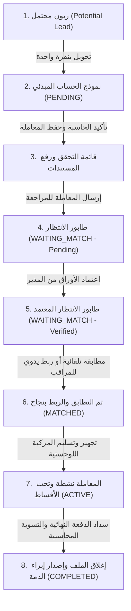

# التقرير الشامل والتفصيلي لدورة حياة الزبون وهيكلية التحقق والربط المالي في منظومة "كفيل" 🚗

> **الإصدار:** 2.0 (محدث ومفصل للمدراء والمطورين)
> **تاريخ التحديث:** مايو 2026
> **اللغة:** العربية الفصحى المبسطة
> **حالة النظام:** متوافق بالكامل مع قواعد الحماية والأمان وتعديلات الربط المتبادل للجهات الضامنة

يرحب بكم دليل منظومة **كفيل**. يقدم هذا التقرير تحليلاً شاملاً وتفصيلياً، وبأسلوب مبسط جداً، لكل ما يتعلق بـ **دورة حياة الزبون**، و**صلاحيات الموظفين**، وآلية **الربط والمطابقة بين الزبائن والضامنين**، وكيفية **احتساب المعادلات المالية**، وصولاً إلى **خطة التحقق والاختبار البرمجي**.

---

## فهرس المحتويات
1. [دورة حياة الزبون (Customer Lifecycle) بالتفصيل والتبسيط](#1-دورة-حياة-الزبون-customer-lifecycle-بالتفصيل-والتبسيط)
2. [صلاحيات وأدوار المستخدمين والأمان الرقمي](#2-صلاحيات-وأدوار-المستخدمين-والأمان-الرقمي)
3. [كيف تعمل آلية المطابقة (الربط التلقائي واليدوي)؟](#3-كيف-تعمل-آلية-المطابقة-الربط-التلقائي-واليدوي)
4. [حالة الربط عبر الفروع والاتصالات المعزولة (Cross-Office)](#4-حالة-الربط-عبر-الفروع-والاتصالات-المعزولة-cross-office)
5. [المعادلة المالية الذكية: خوارزمية المرتب الأدنى (Lowest Salary Rule)](#5-المعادلة-المالية-الذكية-خوارزمية-المرتب-الأدنى-lowest-salary-rule)
6. [خطة التحقق والاختبار الثلاثية (Verification Plan)](#6-خطة-التحقق-والاختبار-الثلاثية-verification-plan)
7. [الرؤية المستقبلية للتطوير والتحسين](#7-الرؤية-المستقبلية-للتطوير-والتحسين)

---

## 1. دورة حياة الزبون (Customer Lifecycle) بالتفصيل والتبسيط

تمر أي معاملة تمويل للزبون داخل منظومة **كفيل** بثماني مراحل أساسية ومترابطة. هذه المراحل تحكمها "آلة حالة برمجية" (State Machine) لضمان عدم تخطي أي خطوة قانونية أو مالية.

### مخطط تدفق دورة حياة المعاملة:

---

### جدول تفصيلي للمراحل الثمانية:

| الرقم | اسم المرحلة البرمجية | ماذا تعني باللغة المبسطة؟ | المسؤول عنها | الشاشة المستخدمة في المنظومة | الإجراء المطلوب للانتقال للمرحلة التالية |
|:---|:---|:---|:---|:---|:---|
| **1** | **زبون محتمل**  `Potential Lead` | زبون استفسر هاتفياً أو زار المعرض، ولم يقرر الشراء بعد. نسجل بياناته لمتابعته هاتفياً وتذكير الموظف بمواعيد الاتصال. | موظف المبيعات (Staff) | `PotentialCustomers.tsx` | الضغط على زر **"تحويل إلى زبون نشط"** لنقل بياناته آلياً دون إعادة كتابتها. |
| **2** | **قيد الإدخال المبدئي**  `PENDING` | الزبون قرر الشراء، ويقوم الموظف بإدخال بياناته التفصيلية وحساب التمويل الأولي على حاسبة المعرض. | موظف المبيعات (Staff) | `CustomerForm.tsx` & `Calculator.tsx` | كتابة التفاصيل المالية والضغط على **"حفظ المعاملة"** لإنشاء معرّف معاملة فريد (UUID). |
| **3** | **تجميع المرفقات**  `PENDING (Checklist)` | رفع المستندات الورقية الهامة (شهادة المرتب، الرقم الوطني، الوضع العائلي) كملفات رقمية أو التأشير عليها بالاستلام الورقي. | موظف المبيعات (Staff) | `DocumentUploader.tsx` | التأشير على جميع الأوراق الإلزامية والضغط على **"إرسال المعاملة للمراجعة والاعتماد"**. |
| **4** | **في انتظار المراجعة**  `WAITING_MATCH (Pending)` | المستندات تم رفعها إلكترونياً، والآن المعاملة تنتظر تدقيق واعتماد المدير أو المحاسب للتأكد من خلوها من التزوير أو الأخطاء. | المدير أو المحاسب | `WaitingQueue.tsx` | مراجعة الملفات المرفقة ثم الضغط على **"اعتماد الأوراق"** لترقية حالة التدقيق إلى `verified`. |
| **5** | **انتظار التطابق والضامن**  `WAITING_MATCH (Verified)` | أوراق الزبون سليمة وقانونية، وهو الآن جاهز في الطابور العام للبحث عن ضامن يعمل في نفس جهته الوظيفية ولديه راتب متوافق. | محرك المطابقة / المراقب | `WaitingQueue.tsx` & `MonitorDashboard.tsx` | العثور على زبون آخر مؤهل للربط التبادلي (تلقائياً عبر خوارزمية البنك أو يدوياً بواسطة المراقب). |
| **6** | **تم التطابق والربط**  `MATCHED` | تم ربط الزبون بضامنه بنجاح. في هذه اللحظة، **تُقفل الحاسبة تلقائياً على خوارزمية "الراتب الأدنى"** لحماية أموال المعرض. | النظام / مراقب العمليات | `MonitorDashboard.tsx` | قيام مراقب اللوجستيات بتجهيز السيارة وشحنها للمكتب المعني وتسليمها للزبون. |
| **7** | **المعاملة نشطة**  `ACTIVE` | استلم الزبون سيارته وبدأ رسمياً في دفع الأقساط الشهرية. تظهر أقساطه ومواعيد استحقاقها في الكشوفات المالية. | المحاسب / الموظف | شاشة لوحة التحكم الرئيسية والتقارير المالية | سداد جميع الأقساط المترتبة على المعاملة بالكامل وتصفية القيم المتبقية. |
| **8** | **المعاملة مكتملة**  `COMPLETED` | تم سداد كامل قيمة التمويل وعمولة المعرض وصرف مستحقات الموظف. يتم إغلاق المعاملة وإصدار شهادة الخروج للمركبة. | المحاسب (Accountant) | `Settlements.tsx` | رفع صورة الصك المالي النهائي، ثم طباعة **شهادة إبراء الذمة وإذن خروج السيارة الرسمي**. |

---

## 2. صلاحيات وأدوار المستخدمين والأمان الرقمي

تمت برمجة منظومة **كفيل** باتباع نموذج صلاحيات صارم (Role-Based Access Control) لحماية الأسرار التجارية والبيانات الشخصية للزبائن، وتفادي الاختراقات المالية.

### جدول مصفوفة الصلاحيات (Capability Matrix):

| ميزة الأمان والصلاحية | موظف إدخال البيانات (Staff) | محاسب الفرع (Accountant) | مدير الفرع (Manager) | مراقب العمليات (Monitor) |
|:---|:---:|:---:|:---:|:---:|
| **تسجيل الزبائن والمتابعة** |  نعم (كامل) |  عرض فقط |  نعم (كامل) |  عرض فقط |
| **تعديل الحاسبة وحفظ المعاملة** |  نعم |  عرض فقط |  نعم |  لا |
| **رؤية أرقام هواتف الزبائن كاملة** | **لا (مغبشة جزئياً)** | **لا (مغبشة جزئياً)** |  **نعم (كاملة)** | **لا (مغبشة جزئياً)** |
| **اعتماد وتدقيق المستندات** |  لا |  نعم |  نعم |  لا |
| **رؤية سعر الشراء بالكاش والأرباح** | **لا (محجوبة بقفل ذهبي)** |  نعم (للتسوية) |  **نعم (كامل)** |  لا (محجوبة) |
| **إجراء التسويات وإغلاق الملفات** |  لا |  نعم (كامل) |  نعم (اعتماد) |  لا |
| **تعديل إعدادات الفرع وسقف الربط** |  لا |  لا |  نعم (كامل) |  لا |
| **الربط اليدوي التبادلي عبر الفروع** |  لا |  لا |  لا |  **نعم (صلاحية خاصة)** |
| **تحديث مراحل تسليم وتجهيز السيارات** |  لا |  لا |  لا |  **نعم (لوجستيات مركزية)** |

### تفصيل فلسفة الأمان الرقمي في المنظومة:
1. **تغبيش الهواتف (Phone Masking):** يتم عرض الأرقام هكذا (`091***789`) لجميع الموظفين والمراقبين والمحاسبين. المدير وحده من يرى الرقم كاملاً. الهدف هو حماية قاعدة عملاء المعرض ومنع تسريب البيانات المنافسة.
2. **شاشة القفل الذهبي الزجاجية (`PremiumLockOverlay`):** عند محاولة موظف المبيعات أو المندوب الدخول لشاشات أرباح المعرض أو سعر الشراء الفعلي للسيارات بالعملة الأجنبية، يظهر حاجز زجاجي متحرك ومضيء باللون الذهبي يمنعه من الوصول، مع إصدار تنبيه أمني للإدارة.
3. **أمان البيانات السحابي (Row-Level Security - RLS):** تم بناء حماية قواعد البيانات سحابياً بحيث لا يمكن لأي فرع استدعاء بيانات معاملات زبائن فرع آخر، باستثناء العمليات المعتمدة للربط التبادلي المركزي للمراقب العام.

---

## 3. كيف تعمل آلية المطابقة (الربط التلقائي واليدوي)؟

تعتمد المنظومة على خوارزمية ذكية لمطابقة الطلبات وتقليل المخاطر المالية عبر طريقتين للربط:

### أ. محرك المطابقة التلقائي (Auto-Match Engine):
1. عند دخول زبون إلى قائمة الانتظار المعتمدة (`WAITING_MATCH` مع حالة تدقيق `verified`).
2. يقوم النظام بتشغيل دالة قواعد البيانات السحابية `attempt_auto_match` عند نقر المدير على زر "بحث تلقائي".
3. يبحث النظام عن زبائن آخرين تتطابق معهم الشروط الثلاثة الذهبية:
   - كلاهما معتمد وورقه مستوفى بنسبة 100%.
   - **تطابق جهة العمل (تم إلغاؤه في التحديث v1.7.0):** لم يعد يُشترط عمل الطرفين في نفس الجهة تماماً لتسهيل وتسريع عمليات الربط التلقائي والتبادلي.
   - فارق المرتب بين المستفيد وضامنه لا يتجاوز السقف المالي المحدد للفرع (مثلاً: لا يزيد عن 50 دينار ليبي).

### ب. محرك الربط اليدوي للمراقب (Manual Matchmaking):
يمتلك **مراقب العمليات المركزي (Operations Monitor)** رؤية شاملة لكامل فروع ليبيا، وتسمح له صلاحياته الخاصة بإجراء **ربط تبادلي يدوي** لتسهيل الحالات الاستثنائية:
- يمكن للمراقب كسر قيود المكاتب المعزولة وربط زبون من فرع بنغازي بزبون من فرع طرابلس.
- يمكنه إجراء ربط تبادلي ثنائي (زبون أ يضمن زبون ب) أو **ربط دائري ثلاثي** (أ يضمن ب، وب يضمن ج، وج يضمن أ).
- بمجرد الضغط على زر **"تأكيد الربط التبادلي اليدوي"**، يتم ترقية المعاملات المربوطة في نفس الثانية إلى حالة **`MATCHED`** ويتم تسجيل الضامن قانونياً في النظام وتحديث عداد الضامنين إلى مكتمل.

---

## 4. حالة الربط عبر الفروع والاتصالات المعزولة (Cross-Office)

عندما يقوم المراقب بربط زبونين يعملان في فرعين مختلفين (مثال: زبون من "مكتب البركة" وزبون من "مكتب الحرية"):

### 1. عزل البيانات وحماية الخصوصية (Strict Isolation):
* تظل بيانات المستندات الحساسة والكشوفات المالية لكل زبون **محجوبة ومخفية بالكامل** عن موظفي الفرع الآخر. لا يستطيع موظف مكتب البركة فتح ملفات زبون مكتب الحرية، تحقيقاً لأعلى معايير الخصوصية.
* الرابط الوحيد المشترك يكون في جدول الضمان العام للتحقق من سلامة المعاملة المالية واحتساب الرواتب الأدنى.

### 2. تدفق الاتصالات والتنسيق الفعلي (Who Should Call?):
لضمان انسيابية العمل وتجنب الإزعاج، تم تقسيم مسؤولية التواصل مع الزبائن كالتالي:

* **في حالة الربط داخل نفس المكتب (Same-Office):**
  يتولى **موظف إدخال البيانات (Staff)** في المكتب التواصل مع الطرفين هاتفياً وتنسيق حضورهما لتوقيع الصكوك واستلام العقود التمويلية.
  
* **في حالة الربط العابر للمكاتب (Cross-Office):**
  1. يقوم **مراقب العمليات (Operations Monitor)** بدور المنسق المركزي، حيث يرسل إشعاراً فورياً لمديري الفرعين المعنيين عبر لوحة التحكم ("🔗 تم ربط زبونكم يدوياً بضامن من فرع آخر").
  2. يقوم **مدير كل مكتب** بالتواصل مع زبونه التابع له لإخطاره بقبول معاملته المالية وإتمام مطابقتها.
  3. ينسق مدراء الفروع المعنية عبر المنظومة لتحديد موعد توقيع العقود بحيث يوقع كل زبون في مكتبه القريب منه جغرافياً دون تحميل الزبون عناء السفر والتنقل بين المدن.

---

## 5. المعادلة المالية الذكية: خوارزمية المرتب الأدنى (Lowest Salary Rule)

تعتبر هذه الخوارزمية صمام الأمان المالي لمنظومة كفيل لمنع التعثر في السداد.

### فلسفة القانون:
لا يمكن منح تمويل يفوق الجدارة المالية لأضعف الأطراف في عملية الضمان التبادلي. لذلك، بمجرد ربط زبونين وتأكيد المطابقة، تتحول حاسبة الأقساط تلقائياً لاعتماد **الراتب الأقل** بين الطرفين كقاعدة لاحتساب سقف التمويل الأقصى والقسط الشهري.

### المعادلة الرياضية المطبقة آلياً:
$$\text{Active Salary for Calculation} = \min(\text{Beneficiary Salary}, \text{Guarantor Salary})$$

### مثال عملي مبسط (Numerical Example):
افترضنا وجود زبونين تم ربطهما تبادلياً:
* **الزبون الأول (المستفيد):** راتبه الشهري = **3,500 دينار ليبي**.
* **الزبون الثاني (الضامن المرتبط):** راتبه الشهري = **2,400 دينار ليبي**.
* نسبة الاستقطاع المسموح بها قانوناً = **35%** من المرتب.

#### كيف تحتسبها المنظومة تلقائياً؟
1. قبل الربط، يظهر للزبون الأول سقف افتراضي مرتفع مبني على راتبه (3500 دينار).
2. فور حدوث الربط والمطابقة، يكتشف النظام أن راتب الضامن (2400 دينار) هو الأقل.
3. يطلق النظام صافرة أمان، وتتحول الحاسبة للعمل بقيمة راتب الضامن تلقائياً: **2,400 دينار**.
4. يتم احتساب أقصى قسط شهري مسموح به كالتالي:
   $$\text{Maximum Monthly Installment} = 2,400 \times 35\% = 840 \text{ دينار ليبي}$$
5. يتم إعادة رسم سقف التمويل بالكامل ليناسب القسط الجديد (840 دينار)، ويظهر شريط تحذيري ذهبي ناصع للموظف والزبون يعلمه بحدود الأمان الجديدة لحمايتهم من الإفراط الائتماني.

## 6. الرؤية المستقبلية للتطوير والتحسين

للرقي بالمنظومة إلى مستويات عالمية تفوق تطلعات الزبائن والإدارة، نقترح تنفيذ ثلاث تحسينات ذكية في المراحل القادمة:

### 1. الإخطارات والمهام الذكية (Automated CRM Triggers):
* **الفكرة:** ربط تقويم المتابعة للزبائن المحتملين بنظام إرسال رسائل WhatsApp تلقائية للزبون تذكره بموعد زيارته القادمة، مع إرسال بريد إلكتروني تذكيري للموظف المعني بالاتصال.
* **الأثر:** زيادة نسبة تحويل الزبائن المحتملين إلى زبائن نشطين بنسبة تتجاوز 40% وتقليل النسيان البشري.

### 2. المحرر القانوني لتوليد العقود المعتمدة (Interactive PDF Contract Generator):
* **الفكرة:** دمج شاشة التسوية النهائية بمحرك توليد مستندات ديناميكي (مثل `pdfmake` أو `jspdf`) لطباعة عقد المرابحة الإسلامية القانوني المعتمد في ليبيا، شاملاً بصمة الزبون والضامن الرقمية ورمز الاستجابة السريع (QR Code) للتحقق من صحة العقد بالمعرض.
* **الأثر:** إلغاء الحاجة للمعاملات والمستندات الورقية الخارجية وتسريع زمن تسليم المركبة للزبون.

### 3. خوارزمية تقييم المخاطر الائتمانية (Smart Scoring System):
* **الفكرة:** تطوير لوحة ذكاء اصطناعي مبسطة تحلل الملف المالي للزبون وضامنه (قيمة الراتب، جهة العمل، نسبة الديون السابقة، عمر الزبون) لتعطي تقييماً بالألوان (أخضر: مخاطر منخفضة، برتقالي: مخاطر متوسطة، أحمر: مخاطر عالية).
* **الأثر:** حماية أصول المعرض وتوفير رؤية واضحة للمدير العام قبل اتخاذ قرار الموافقة النهائية على التمويل.

---

> [!NOTE]
> هذا التقرير هو المرجع الرسمي الأول المعتمد لمطوري وإداريي منظومة **كفيل**. تم تصميمه لتبسيط التفاصيل التقنية المعقدة وجعلها واضحة ومباشرة للجميع.
